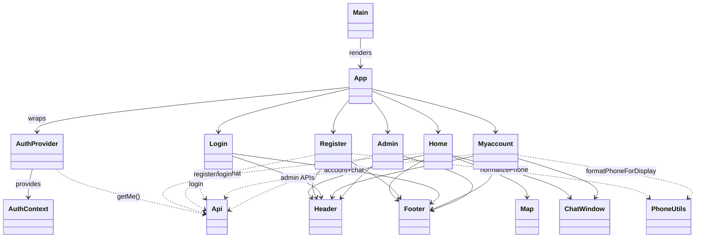

# Frontend UML

```mermaid
%% Modules + page/component wiring
classDiagram
  class Main
  class App
  class AuthProvider
  class AuthContext
  class Api
  class PhoneUtils

  class Home
  class Register
  class Login
  class Myaccount
  class Admin

  class Header
  class Footer
  class Map
  class ChatWindow

  Main --> App : renders
  App --> AuthProvider : wraps
  AuthProvider --> AuthContext : provides
  AuthProvider ..> Api : getMe()

  App --> Home
  App --> Register
  App --> Login
  App --> Myaccount
  App --> Admin

  Home --> Header
  Home --> Footer
  Home --> Map
  Home --> ChatWindow
  Home ..> Api : requests+chat

  Register --> Header
  Register --> Footer
  Register ..> Api : register/login
  Register ..> PhoneUtils : normalizePhone

  Login --> Header
  Login --> Footer
  Login ..> Api : login

  Myaccount --> Header
  Myaccount --> Footer
  Myaccount --> ChatWindow
  Myaccount ..> Api : account+chat
  Myaccount ..> PhoneUtils : formatPhoneForDisplay

  Admin --> Header
  Admin --> Footer
  Admin ..> Api : admin APIs
```
